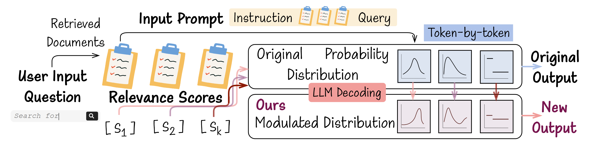

# OpenDecoder
A temporary repository of the WWW 2026 accepted paper - OpenDecoder framework: Open Large Language Model Decoding to Incorporate Document Quality in Retrieval-Augmented Generation.

The checkpoint is available at [our huggingface repo](https://huggingface.co/Meranti/OpenDecoder).

# Running Steps
## 1. Download data and Preprocessing

The used RAG datasets can be downloaded via [FlashRAG](https://huggingface.co/datasets/RUC-NLPIR/FlashRAG_datasets) to obtain the processed datasets (NQ and HotpotQA are used for training, while the others can be used for out-of-domain evaluation). The e5 retriever can be loaded via the [checkpoint](https://huggingface.co/intfloat/e5-base-v2), and the collection for retrieval is [wiki18](https://dl.fbaipublicfiles.com/dpr/wikipedia_split/psgs_w100.tsv.gz). 

Initialize the necessary directory and download the required checkpoint and data into each directory

    mkdir checkpoint
    mkdir datasets

The file structure for datasets is shown below. Please be careful of the path setting in each python script

    ├── checkpoints/ # E5, Qwen, OpenDecoder
    ├── datasets/ 
    │ ├── nq  
    │ ├── hotpotqa
    │ ├── popqa 
    │ ├── trivialqa     
    │ ├── 2wiki     
    │ └── wikipedia
    ├── src/ 
    │ ├── retrieval    
    │ └── model/qwen_decoder
    ├── utils/
    ├── outputs/
    
Then index the Wikipedia collection and construct a mapping from passage ID to passage text. (Remember to use your relative path)

    python ./src/e5_dense_index.py
    python ./utils/wikipid2psg.py

The dense index and a passage ID to content mapping (pid2psg.pkl) are stored under datasets/wikipedia dir.

## 2. Searching External Information and Construct Quality Indicators

The first step of RAG is to retrieve relevant documents, which is achieved by the script as below, and obtain the retrieved top-k list in TREC format under the corresponding dataset's dir -> e.g., /datasets/nq/nq_train_e5.trec and /datasets/nq/nq_test_e5.trec

    python src/retrieval/test_e5_retrieval.py

Since we need to use the relevance scores as document quality indicators in OpenDecoder, we store the top-k documents' ID and scores, as well as the sampled irrelevant ones, for robust training via the script below. The produced results files are under the corresponding dataset's dir -> e.g., /datasets/nq/RAG_train_input.jsonl and /datasets/nq/RAG_test_input.jsonl

    python src/retrieval/construct_indicators.py

The format of the result RAG file is

    {"id": "", "top_pid": [], "top_pid_score": [], "irrel_pid": [], "irrel_pid_score": []}

For generating LLM-rank/QPP score, please run the script as below to produce the result file with the same format.

    python src/retrieval/generate_LLMrank_scores.py
    python src/retrieval/generate_QPP_scores.py

## 3. Open the LLM to Modulate the Computation of the Decoder

### 3.1 Access the LLM
Since the OpenDecoder requires modifying the original attention network computation, the first step is to access the LLM by downloading the Qwen-2.5-3B-instruct [checkpoint](https://huggingface.co/Qwen/Qwen2.5-3B-Instruct) to the path ./checkpoint. As the original official source code does not support additional input to inject relevant indicators, we need to load the initial LLM's weight into a modified architecture of LLM with relevance features as one of the input arguments via the script.

    # Remember to adjust Arguments in /src/model/qwen_decoder/final_config.json according to the used version of the backbone model
    bash ./iniModel.sh 

### 3.2 Modulate Computation
The modified architecture of LLM is indicated in

    ./src/model/qwen_decoder/modeling.py

Within the architecture, we modify the computation of the function "eager_attention_forward" with 

    if kwargs.get("relevant_scores", None) is not None: 
        relevant_scores = kwargs["relevant_scores"].unsqueeze(1).unsqueeze(-1).to(query.dtype)
        query = query * relevant_scores

## 4. OpenDecoder
(1) Train OpenDecoder:

    bash train.sh # single GPU
    bash train_parallel.sh # multiple GPUs

The used indicator features and robust training are controlled by 

    --add_irrelevant_psg True/False \ # whether add noisy doc for Robust Training
    --add_LLM_scores True/False \ # whether add LLM-rank scores
    --add_QPP_scores True/False \ # whether add QPP scores
    --shuffle_RAG True/False \ # whether shuffle the position for Robust Training

We recommend beginning with all False and adjusting accordingly

The trained model is stored under the ./outputs dir

(2) Inference via OpenDecoder:

    bash inference.sh

The evaluation settings are controlled by 

    --add_irrelevant_psg True/False \ # evaluate in noisy setting
    --full_irrelevant_psg True/False \ # evaluate in extreme noisy setting


(3) Inference a minumum example ( question + retrieved docs + relevance scores):

You can inspect and try to run inference_single_sample.py to get an idea of what are expected by OpenDecoder as inputs.
```
python inference_single_sample.py
```

# Citation Info

If you find our paper or models helpful, please consider cite as follows:

```
@article{mo2026opendecoder,
  title={Opendecoder: Open large language model decoding to incorporate document quality in rag},
  author={Mo, Fengran and Su, Zhan and Hui, Yuchen and Zhang, Jinghan and Sun, Jia Ao and Liu, Zheyuan and Zhang, Chao and Sakai, Tetsuya and Nie, Jian-Yun},
  journal={arXiv preprint arXiv:2601.09028},
  year={2026}
}
```

